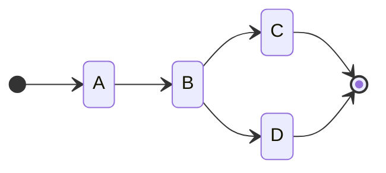

# littleflow

A little flow language with simple objectives:

 * an expression language for defining the flow of tasks
 * a core algorithm for invocation of workflows and tasks
 * flows are independent of task implementation or workflow deployments

This littleflow project is an independent flow language, a workflow engine,
and provides integrations with Redis and Kubernetes.

## A quick introduction

Tasks are simply referenced by name:

```
A
```

The can also have parameters in the form of JSON or YAML literals:

```
A(- hello: world -)
```

You can sequence tasks together with the arrow operator (i.e., `→` U+2192 or `->`) into flow statements:

```
A → B → C
```

And the set of flow statements define a workflow graph:

```
A → B :x → C;
:x → D
```



You can run workflows programmatically in python (see [example-run.py](example-run.py)):

```python
from littleflow import run_workflow

workflow = """
A → B :x → C;
:x → D
"""

def A(input):
   print('A')

def B(input):
   print('B')

def C(input):
   print('C')

def D(input):
   print('D')

run_workflow(workflow,locals())
```

Or compile and run workflows for more complex interactions:

```python
from littleflow import Parser, Compiler, Context, Runner

workflow = """
A → B :x → C;
:x → D
"""

p = Parser()
c = Compiler()

model = p.parse(workflow)
flow = c.compile(model)

context = Context(flow)
runner = Runner()

runner.start(context)

while not context.ending.empty():
   runner.next(context,context.ending.get())
```

There is a [language specification](littleflow.md) for the workflow expressions.

Also, the [Redis](integrations/redis) and [Kubernetes](integrations/k8s) integrations
provide the ability to execute workflows in distributed context for remote
execution of tasks and for long-running workflows. Further, the whole system can
be [deployed on Kubernetes](deployment/).

## Getting started

You can pip install the library:

```
pip install littleflow
```

Workflows are specify in a [language called littleflow](littleflow.md). This
workflow language allows you to describe the flow of steps as a graph and
various parameters.

A workflow is compiled into a graph that can be executed asynchronously. The
workflow itself is represented by a matrix and an index of the tasks. The
state of the workflow is stored in a few vectors. This allows a simple
stateless algorithm run the workflow forward from any state represented by
those vectors. As such, those vectors can be save and restored from
storage.

The core library provides:

 * the language parser and compiler
 * the core algorithm
 * base classes for building more complex execution environments (e.g., for distributed execution or state storage)

There is also:

 * A [Redis integration](integrations/redis) for caching workflow state information and
   workflow events to enable distrubuted execution
 * A [Kubernetes integration](integrations/k8s) that builds on the Redis integration to
   provide a way to execute tasks as [Kubernetes jobs](https://kubernetes.io/docs/concepts/workloads/controllers/job/).
 * A [Kubernetes deployment](deployment) that provides a way to deploy the framework on your Kubernetes cluster via [kustomize](https://kubernetes.io/docs/tasks/manage-kubernetes-objects/kustomization/).


## Commands

The `littleflow` module is executable and provide several commands.

### compile

```
python -m littleflow compile WORKFLOW
```

where `WORKFLOW` is a [littleflow workflow](littleflow.md) file.

This command will parse and compile a workflow and output various information
about the workflow.

### doc

```
python -m littleflow doc WORKFLOW
```

where `WORKFLOW` is a [littleflow workflow](littleflow.md) file.

This command will generate a [mermaid diagram](https://mermaid-js.github.io/mermaid/#/) that represents the workflow graph.

### run

```
python -m littleflow run WORKFLOW
```

where `WORKFLOW` is a [littleflow workflow](littleflow.md) file.

This command will run a workflow with a pseudo-task executor that runs each
task as a simple echo of input to output.

This command is primarily for testing purposes. The [integration with redis](integrations/redis) provides a way to run workflows with real task executors.

### version

```
python -m littleflow version
```

This command outputs the littleflow version.
