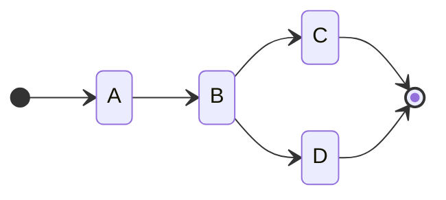

# littleflow

A little flow language with simple objectives:

 * an expression language for defining the flow of tasks
 * a core algorithm for invocation of workflows and tasks
 * flows are independent of task implementation or workflow deployments

This littleflow project is an independent flow language, a workflow engine,
and provides integrations with Redis and Kubernetes.

## A quick introduction

Tasks are simply referenced by name:

```
A
```

The can also have parameters in the form of JSON or YAML literals:

```
A(- hello: world -)
```

You can sequence tasks together with the arrow operator (i.e., `→` U+2192 or `->`) into flow statements:

```
A → B → C
```

And the set of flow statements define a workflow graph:

```
A → B :x → C;
:x → D
```



You can run workflows programmatically in python (see [example-run.py](example-run.py)):

```python
from littleflow import run_workflow

workflow = """
A → B :x → C;
:x → D
"""

def A(input):
   print('A')

def B(input):
   print('B')

def C(input):
   print('C')

def D(input):
   print('D')

run_workflow(workflow,locals())
```

Or compile and run workflows for more complex interactions:

```python
from littleflow import Parser, Compiler, Context, Runner

workflow = """
A → B :x → C;
:x → D
"""

p = Parser()
c = Compiler()

model = p.parse(workflow)
flow = c.compile(model)

context = Context(flow)
runner = Runner()

runner.start(context)

while not context.ending.empty():
   runner.next(context,context.ending.get())
```

There is a [language specification](littleflow.md) for the workflow expressions.

Also, the [Redis](integrations/redis) and [Kubernetes](integrations/k8s) integrations
provide the ability to execute workflows in distributed context for remote
execution of tasks and for long-running workflows.

## Getting started

In this example we can compile and run a workflow:

```python
from littleflow import Parser, Compiler, Context, Runner

workflow = """
A → {
  B → C
  D
} → E
"""

p = Parser()
c = Compiler()

model = p.parse(workflow)
flow = c.compile(model)

context = Context(flow)
runner = Runner()

runner.start(context)

while not context.ending.empty():
   runner.next(context,context.ending.get())
```

This is further simplified with a utility function that also supports function lookups for tasks:

```python
from littleflow import run_workflow

workflow = """
A → {
  B → C
  D
} → E
"""

def A(input):
   print('Hello ',end='')

def B(input):
   print('workflow ',end='')

def D(input):
   print('world, ',end='')

def C(input):
   print('how are ',end='')

def E(input):
   print('you?')

run_workflow(workflow,locals())

```

Tasks are ordered by execution invocation. While some may be run in parallel,
this relative to task invocation innovation.

Typically, a real usage would implement both the `start()` and `end()` methods
on `FlowContext` that will start tasks and notify when these tasks end. Also, at task ends,
the loop for execution would likely be asynchronous based on end task event
notification.

## Writing workflows

Workflows are specify in a [declarative mini-language called littleflow](littleflow.md). This
language allows you to describe the flow of steps and instructions between steps.

## Running workflows

These workflows are compiled into a graph that can be executed asynchronously. The
state of the workflow is stored in a few simply vectors. This allows a simple
stateless library to executed a workflow once those vectors are restored from
storage.

## Deployment

Littleflow is integrated with Redis and Kubernetes for distributed execution. See [deployment](deployment) for more information.
