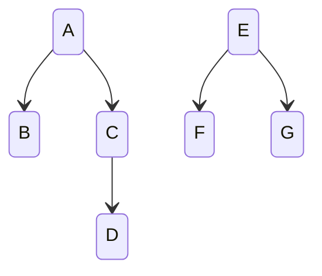
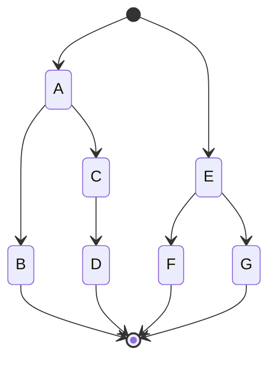
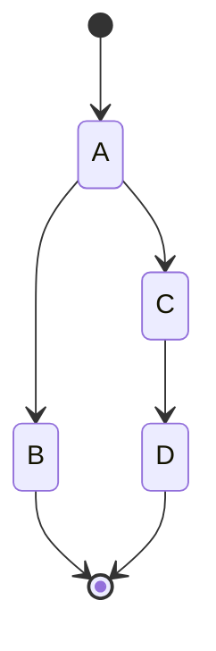

# A little flow language

## A brief introduction

Workflows are tasks that occur within some set of relationships. That
is, a workflow forms a graph where the nodes are tasks and the edges are the
relationships. The relationships in the graph provide ordering of which tasks
occur in what order by the preceding tasks they may depend upon and other
criteria (e.g., conditionals).

By the nature, *workflows are not DAGs* as some have cycles and partitions. As
such, in this context, a workflow is a graph that:

 1. Every node represents a task in the workflow.
 1. Every edge is a directed edge.
 1. For any two distinct nodes A and B, there is only a single directed edge from A to B.

With this definition, a few observations:

 * Nodes are not required to be connected.
 * A workflow can consist of disconnected subgraphs
 * Cycles are allowed

As the edges are directed, each subgraph in the workflow has a maximal join that can be considered the starting point of the subgraph. In the diagram below, `A` and `E` are the start of each subgraph as they are the maximal joins:



Given the maximal elements, we can infer a start and end to the workflow from the subgraphs:



A workflow is a *flow* of information from task to the next. The workflow has a single input that is passes to each starting tasks. These tasks may produce a single output. This output
flows over the edge connecting two tasks.

For example, in the following workflow, task `A` receives the workflow input and
produces its output. That output is fed into tasks `B` and `C` and the output of task `C` is fed into task `D`. At the end, the meet of tasks `B` and `D` in the workflow, the final output of the workflow is the collection of the output of tasks `B` and `D` (e.g., a list containing the two outputs).




**The purpose of the inputs and outputs are to provide tasks with execution context.** Typically,
this is not the main purpose of the workflow but information (e.g., metadata) needed to
locate information in the environemtn. For example, the input to the pipeline might be
a reference to customer record or data object sufficient for the workflow tasks to
retrieve information from a database.

As long as tasks pass the context along, possibly enhancing the context with additional information, the following tasks will have sufficient information to proceed. This enables the construction of workflows that are more generic. That is, instead of specializing a workflow with parameters specific to the invocation, the context for the invocation is the input to the workflow.

As such, over the edge flows information. Each task receives inputs over incoming edges and outputs information over outgoing edges. This information provides subsequent tasks the ability to evaluate what and whether they can perform their own task.

## What are tasks?

A task follows these rules:

 * may consume a single input and produce a single output.
 * may have side effects in the execution environment. That is, it does not have to be completely functional
 * may have additional parameters

While conceptually a task can be anything:

 * a function that receipts instructions via the input and parameters and product outputs without side-effects
 * an external process whose arguments a combination of the parameters and the input that affects the state of the world (e.g., by producing some number of artifacts)
 * an invocation of a service via an API
 * interaction with a person or intelligent device (e.g., a robot)

Concretely, a task is invoked by a workflow engine that feeds the task its context (i.e., parmaeters and input) and receives an output. Once complete, the engine determines the next step in computation and feeds outputs to inputs. Tasks are "black boxes" with metadata, an input, and an output.

## Technical foundation

A flow represents a workflow as a graph that:

 1. Nodes represent tasks.
 1. Edges are directed.
 1. An edge from A to B means that A occurs before B.
 1. Two distinct nodes A and B are only connected by one edge from A to B.
 1. Nodes in the graph may have the same label. This means they are the same task but in a different invocation context.

A sequence of structured information flows between nodes over directed edges. A task may choose how to interpret such information from all incoming edges.

Information flowing between tasks is limited to tree-structured information that typically be represented in a JSON [1] or YAML [2] data format.

A task:

 * receives a sequence of input data, possibly empty, over incoming edges
 * produces a single output, possibly empty, over outgoing edges
 * may create side-effects

A *side effect* is typically an artifact or change in state of the world. For example, a task may write data to database, notify a user, or invoke actions in the physical world.

Within the workflow itself, only the data flowing over the edges is explicitly know by the workflow engine for each task. Task writers by choose to convey information via the data flow or via side effects. Any information outside of the inputs and outputs is out of scope for the workflow engine execution.

A task in a workflow is not a replacement for a general purpose programming language. It
is simply a representation of a task that is implemented in some language or system. The workflow engine must pass the input and any parameters to that system. When the task completes, the workflow engineer receives an output which can then be used for following tasks.

## A syntax for workflows

The goals of this syntax are:

 1. A compact representation of the workflow graph
 1. A representation of tasks and their metadata operations
 1. Enabling common expressions over metadata between tasks (e.g., conditionals)

A workflow is a sequence of whitespace separated statements. Each statement starts with a label or task name, a sequence of arrow operations, and ends with a label or task name.

The graph is constructed with a single arrow operator (i.e., '→' U+2192 or '->') to connect two tasks.

A task is identified by name which are alpha-numeric along with the hyphen ('-') and underscore ('_') (e.g., `my-task`).

A task typically acts on inputs from within the pipeline.may have parameters, typ indicated by keyword/value pairs within parenthesis (e.g. `range(start=1,end=10)`).

A flow statement is a sequence of arrow operations:

```
transform → inference → store
```

Two different flow statements can be combined with a label that prefixed with a colon:

```
transform → :transformed
:transformed → inference → store_outcome
:transformed → store_source
```

A flow statement can be terminated by an optional semicolon to remove
ambiguity. For example:

```
A :out → B
:out → C
```

is the same as (which is also an error):

```
A :out → B :out → C
```

To send the output of A to both B and C, you must terminate the first flow statement:

```
A :out → B;
:out → C
```

or terminate the first flow statement with a different label:
```
A :out → B → :end
:out → C
```


The workflow graph has meets where two or more outputs may converge on a single task and this may require labeling a particular edge to attached another task outcome.

For example, to have the output of A and B meet at C:

```
A → :meet C → D → E
B → :meet
```

To use the output of A as the input to B:

```
A :out →  C → D → E ;
:out → B  
```

At the start of a flow statement, a label identifies the input:

```
:before → A → B → C
```

And the end of a flow statement, a label identifies the output:

```
A → B → C → :after
```

To facilitate meets and joins without labels, the vertical bar ('|') operator allows to list multiple tasks.

For example, a simple "fan in" or "meet" can be represented as:

```
A|B|C → D
```

is equivalent to:

```
A → :meet D
B → :meet ;
C → :meet
```

or

```
A → :meet ;
B → :meet ;
C → :meet ;
:meet → D
```


Also, a simple "fan out" or "join" can be represented as:

```
D → A|B|C
```

is equivalent to:

```
D :join → A ;
:join → B ;
:join → C
```

or

```
D → :join
:join → A ;
:join → B ;
:join → C
```

A resource by a URI reference in angle brackets:

```
<dataset.json> → inference → store
```

A resource is effectively an implicit task that loads the resource produces the content as its output. The URI is relative to the effective base URI of the workflow

Within a dataset, a resource may be in JSON or YAML syntax natively. An implementation is free to
provide other syntax transformers.

A resource can also be a following task which commits the input to the resource:

```
load → score → <http://example.com/myservice/api/v1/store>
```

A resource may be parameterized to enable options like HTTP method, etc.:

```
load → score → <http://example.com/myscores.json>(- method: PUT -)
```

An implementation may provide out-of-band configuration options for accessing resources that require specific credentials.

Also, it can be useful to qualify whether a task should occur rather than have the decision within the task itself.

```
A → if `.status==0` then B
    else C
```

The expression is within back quotes and the preferred language is jsonpath [3]. The consequence of a conditional is a task invocation.

Sometimes tasks output sequences of objects and the following tasks are intended for single inputs. In other cases, the sequence of objects are parameterization of parallelism (e.g., hyperparameters for a model).

By default, the input to a task is the whole sequence. To iterate over a the sequence, invoking the follow task for each item in the sequence, we use the multiple operator '*'.

For example, assume that `sequence.json` contains data in JSON-SEQ format (`application/json-seq`):

```JSON
{"x":12,"y":24}
{"x":3,"y":96}
{"x":7,"y":12}
{"x":7,"y":7}
```

The follow flow will invoke the task A for each object in the sequence:

```
<seqeuence.json> → * A
```

Similarly, a flow may require iteration or spreading outputs to a whole "sub-workflow". To facilitate brevity, a subflow can be contained in curly brackets:

```
A → {
  B → C
  D  
} → E
```

which is equivalent to:

```
A :out → B → C → :in E ;
:out → D → :in
```

Iteration is also available for subflows:

```
A → * {
  B → C
  D  
} → E
```

which is equivalent to:

```
A :out → * B → * C → :in E ;
:out → * D → :in
```

## Stitching the graph

Every task in a flow statement is unique. A workflow graph is stitched together from all instances of tasks by label references. A task referenced more than once is a distinct invocation of the same task.

For example, this is workflow with two distinct and separate flows:

```
A → C
B → C
```

While this workflow has a single instance of task C:

```
A → :meet C
B → :meet
```

Stitching becomes more complicated with conditionals. Conditionals generate an implicit task-like node.

Consider:

```
A → if `.status==0` then B
    else C → D
```

The possible execution traces are:

```
A → B → D
A → C → D
```

## First and last tasks

Any task in a workflow has preceding tasks (those from incoming edges) and following tasks (those connected to outgoing edges). Assuming a left-is-preceding orientation, the left-most tasks are those without any preceding task and the right most is those without any following tasks.

The label `:start` is a reserved label for all the left-most tasks.

The label `:end` is a reserved label for all the right-most tasks.

Thus, the workflow:

```
A → B → C
D → E
F → B
```

is equivalent to:

```
:start → A → B → C → :end
:start → D → E → :end
:start → F → B
```

A resource is automatically a left-most task.

## Task definitions

A task is referred to by name and invoked with simple parameter values. As such, it is not necessary to declare a task. An implementation can determine the set of names and parameters used.

Within an implementation, the actual task definition may be far more complicated and implementation specific. That definition is out of scope for this specification.

A implementation can identify the tasks referred, the parameters used (and not used), and match the invocation to expected definitions and constraints. Subsequently, it can raise errors as necessary.


## Task inputs and outputs

A task receives a set of inputs of structured information. If a preceding task produces no output or there is no preceding tasks, the input is a singleton empty object (i.e., `{}`). Similarly, if a task produces no explicit output upon completion, it defaults to produce a singleton empty object.

A task may output more than one structured object as its output (e.g., a sequence of numbers, vectors, objects, etc.).

When two tasks are joined (e.g. `A → B`), the input is simply the output of the preceding task.

If there are more than two incoming edges, the inputs are aggregated via the following rules:

 1. All singleton empty objects are equivalent and merged into a single empty object.
 1. If a non-empty object is present, singleton empty objects are omitted.
 2. If multiple inputs are present, the union of all the non-empty objects is the input.

In short, inputs are merged into a single sequence of structured objects with duplicate empty objects merged or omitted when non-empty objects are present.

The left-most tasks (i.e., :start) are sent a singleton empty object. The outputs of all the right-most tasks are aggregated using the rules above. Where the output of the overall workflow is

## Parameter literals

A task may be explicitly parameterized within the workflow:

```
A (- delete: true -) → B ({"flush":true})
```

For parameter literals:

 * a YAML literal is contained within `(-` and `-)` delimiters
 * a JSON object is contained within `({` and `})` delimiters
 * a JSON array is contained within `([` and `])` delimiters

## Resource literals

Flows may also start with a literal:

```
<- customer: C123 -> → A → B
```

For parameter literals:

 * a YAML literal is contained within `<-` and `->` delimiters
 * a JSON object is contained within `<{` and `}>` delimiters
 * a JSON array is contained within `<[` and `]>` delimiters

## Reserved words

A task may not have the following names:

 * if
 * then
 * else
 * elif

## Reserved labels

A label may have any name with the exception that `:start` and `:end` have special semantics. When used, `:start` must be the left-most task (the start of the workflow) and `:end` must be the right-most task (the end of the workflow).
